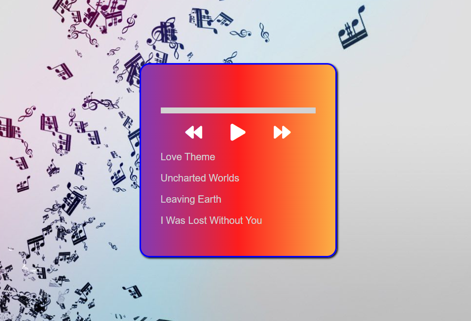

# Music Player made with Javascript

- <a href="https://www.youtube.com/watch?v=smyWFCJ_Kb8">Tutorial Link</a>
- On this occasion, we reproduce four themes of the original soundtrack of the Mass Effect video game.
-
- 
  

## Description

- Full structure of HTML.
- Functions in JavaScript:
- Using Dom
- Listen audio element.
- Click controls events.
- Load songs and list, load selected song.
- Upgrade cover.
- Update a song progress bar.
- Play or change a song. Go to the next when the current ends.
- Styles with CSS.

## To Do

- Improve code, and styles css.
- Refactor.
